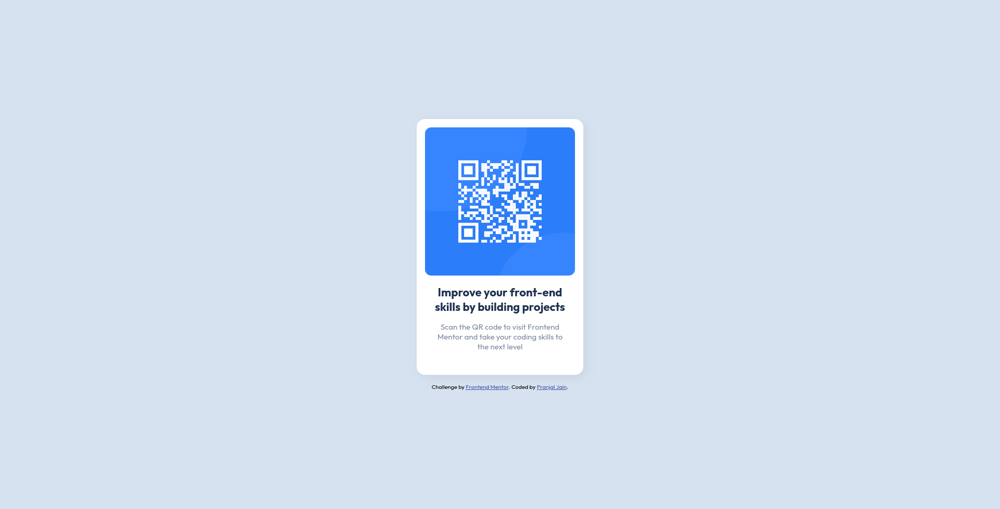

# Frontend Mentor - QR code component solution

This is a solution to the [QR code component challenge on Frontend Mentor](https://www.frontendmentor.io/challenges/qr-code-component-iux_sIO_H). Frontend Mentor challenges help you improve your coding skills by building realistic projects. 

## Table of contents

- [Frontend Mentor - QR code component solution](#frontend-mentor---qr-code-component-solution)
  - [Table of contents](#table-of-contents)
  - [Overview](#overview)
    - [Screenshot](#screenshot)
    - [Links](#links)
  - [My process](#my-process)
    - [Built with](#built-with)
    - [Useful resources](#useful-resources)
  - [Author](#author)

**Note: Delete this note and update the table of contents based on what sections you keep.**

## Overview

### Screenshot

### Links

- Solution URL: [qr-code-component](https://github.com/yellowjacketcoder/qr-code-component)
- Live Site URL: [Live Site](https://yellowjacketcoder.github.io/qr-code-component/)

## My process

### Built with

- Semantic HTML5 markup
- CSS custom properties
- Flexbox

### Useful resources

- [Thomas Sankara's Solution](https://www.youtube.com/watch?v=JFyMWwOxHYM) - This helped me fix the title in the container. I was really stuck on getting it to match the design and never thought to use headings. Also explained flex properties very well which I already knew but his explanation is what I will use in the future.

## Author

- GitHub - [Pranjal Jain](https://github.com/yellowjacketcoder)
- LinkedIn - [Pranjal Jain](https://linkedin.com/in/pja1n)